# University of Denver Data Analytics Boot Camp: Web Scraping Homework - Mission to Mars

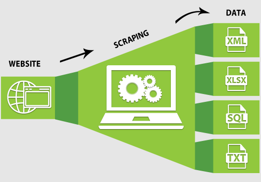

## Overview: This project consists of scraping four different websites for information regarding Mars and space exploration. Python is used to create the code and Flask used to scrape and store/retrieve the data from MongoDB. HTML is used for visualization and setup with a "Scrape" button to pull in new data as the websites are updated. 

## Step 1 - Scraping

Complete your initial scraping using Jupyter Notebook, BeautifulSoup, Pandas, and Requests/Splinter.

### NASA Mars News

* Scrape the [NASA Mars News Site](https://mars.nasa.gov/news/) and collect the latest News Title and Paragraph Text. Assign the text to variables that you can reference later.
#### Jupyter Notebook Code
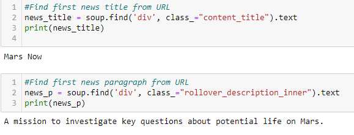
#### HTML Output
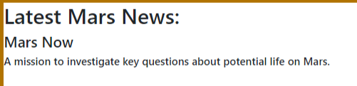

### JPL Mars Space Images - Featured Image

* Visit the url for JPL Featured Space Image [here](https://www.jpl.nasa.gov/spaceimages/?search=&category=Mars).

* Use splinter to navigate the site and find the image url for the current Featured Mars Image and assign the url string to a variable called `featured_image_url`.

#### Jupyter Notebook Code
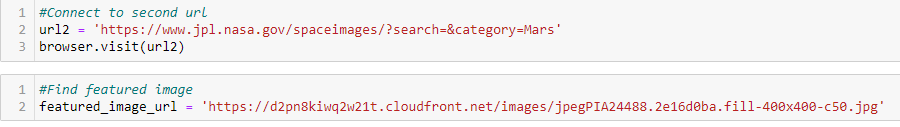
#### HTML Output
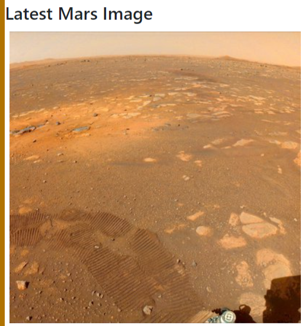

### Mars Facts

* Visit the Mars Facts webpage [here](https://space-facts.com/mars/) and use Pandas to scrape the table containing facts about the planet including Diameter, Mass, etc.

* Use Pandas to convert the data to a HTML table string.
#### Jupyter Notebook Code
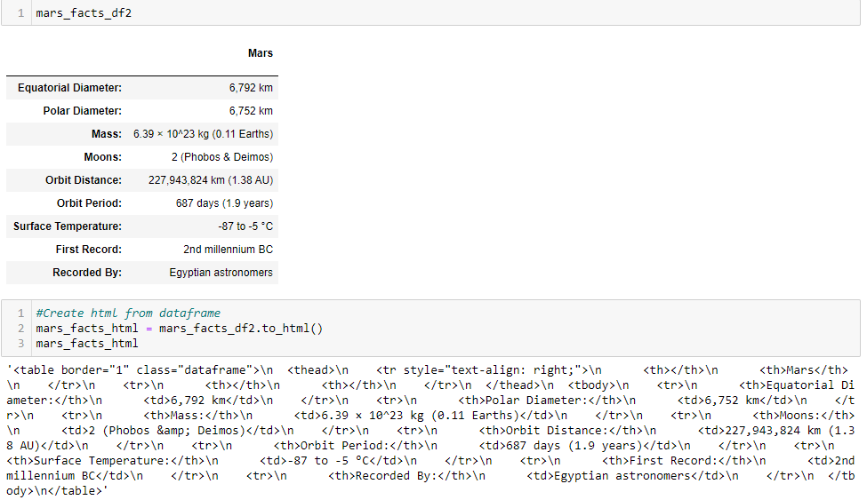
#### HTML Output
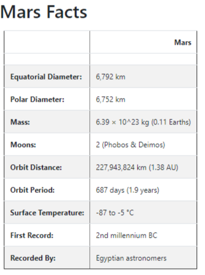

### Mars Hemispheres

* Visit the USGS Astrogeology site [here](https://astrogeology.usgs.gov/search/results?q=hemisphere+enhanced&k1=target&v1=Mars) to obtain high resolution images for each of Mar's hemispheres.

* Append the dictionary with the image url string and the hemisphere title to a list. This list will contain one dictionary for each hemisphere.
#### Jupyter Notebook Code
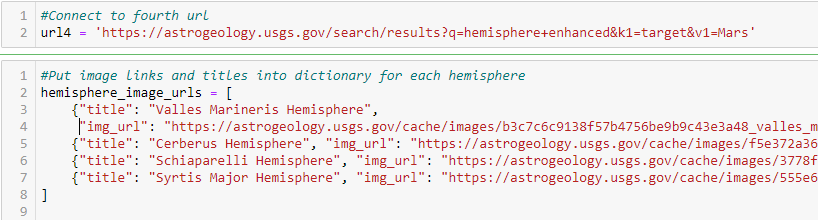
#### HTML Output
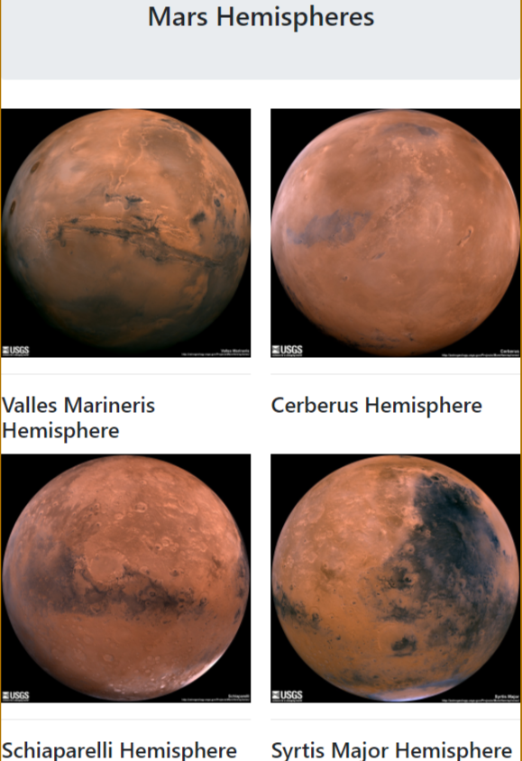

- - -

## Step 2 - MongoDB and Flask Application

Use MongoDB with Flask templating to create a new HTML page that displays all of the information that was scraped from the URLs above.

* Start by converting your Jupyter notebook into a Python script called `scrape_mars.py` with a function called `scrape` that will execute all of your scraping code from above and return one Python dictionary containing all of the scraped data.
#### Python Scrape Function

* Next, create a route called `/scrape` that will import your `scrape_mars.py` script and call your `scrape` function.

* Create a root route `/` that will query your Mongo database and pass the mars data into an HTML template to display the data.
#### Python Routes

* Create a template HTML file called `index.html` that will take the mars data dictionary and display all of the data in the appropriate HTML elements. Use the following as a guide for what the final product should look like, but feel free to create your own design.
#### HTML Input

* Use Splinter to navigate the sites when needed and BeautifulSoup to help find and parse out the necessary data.

* Use Pymongo for CRUD applications for your database. For this homework, you can simply overwrite the existing document each time the `/scrape` url is visited and new data is obtained.
#### Pymongo DB

#### Final HTML
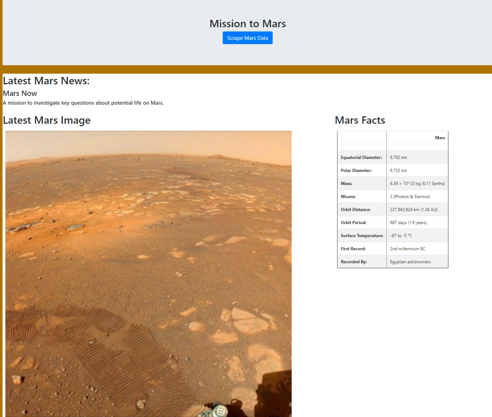
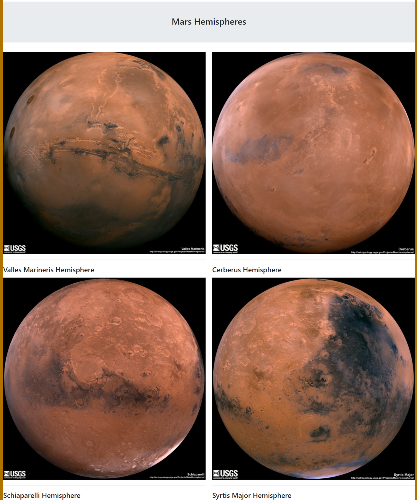
